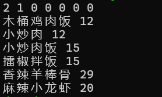
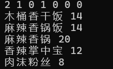

# 本文为程序编译使用的简易说明
## 注意事项
1.编译包含Python.h头文件的cpp时，常常遇到找不到头文件的问题，所有请按照以下指令编译cpp文件
>  g++ select.cpp `python3.8-config --cflags` -o select `python3.8-config --ldflags` -lpython3.8 -no-pie

2.以及注意使用pandas读取excel的时候由于openpyxl读取数字自动调用numpy.float()的问题
由于从numpy=1.24.0开始就淘汰了numpy.float而直接使用float了，遇到关于上述问题的报错可以更新openpyxl
>pip install --upgrade openpyxl

3.在windows下的编译指令为：(请将-I和-L后的内容改为头文件和相应lib的地址)
> g++ -ID:\anaconda\include -LD:\anaconda\libs -o output.exe select.cpp -lpython311

4.在qt中为了编译和运行正确，例如我使用的是CmakeList.txt和cmake作为编译控制器，首先需要在

'''cpp
set(PROJECT_SOURCES
        main.cpp
        mainwindow.cpp
        mainwindow.h
        mainwindow.ui
        ./dish_group/select.h
        ./dish_group/data_frame.py
        D:/anaconda/include/Python.h
        ${TS_FILES}
)
'''
## 程序原理和使用说明
1.程序原理时通过python调用pandas来将excel的xlsx数据读取作为dataframe，然后使用python进行搜索，并且将搜索内容的菜名和价格作为两个数组打包为元组发送到cpp中，其中菜名转换为类型为string的vector，而价格转换为类型为int 的vector，可以从vector里面提取数据

2.使用说明，我这里用于示范的是直接从控制台读入筛选条件：例如 2 1 0 0 0 0 0 表示辣度为2，含有肉类，不含有海鲜，不含有豆制品，不是面食，不是点心或凉菜，不是汤品这些筛选条件，为了方便显示，我将储存在vector中的元素都打印在控制台中了，结果如图片所示

下面也同理，与上面筛选条件不同的是既含有肉类又含有豆制品

